# ShaversHaven

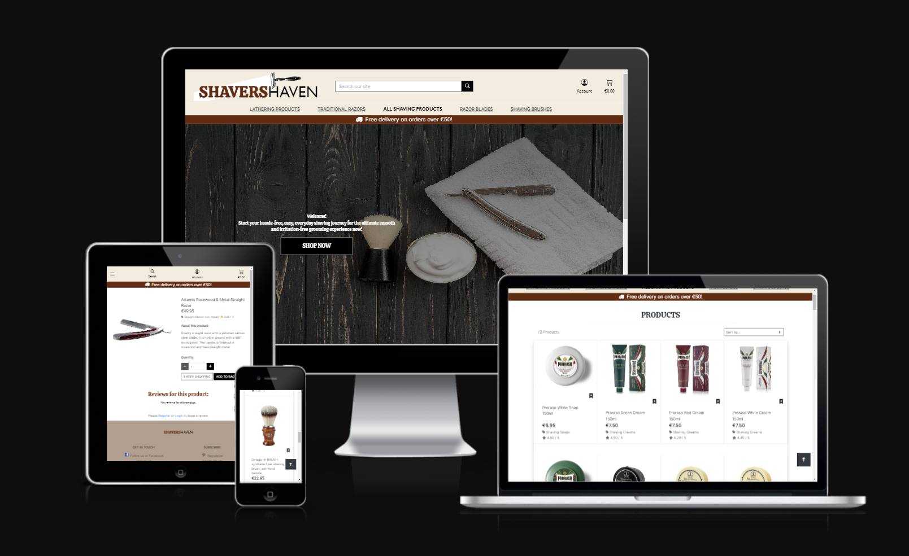

Live [Shavers Haven](https://shavers-haven-b1ce6026470c.herokuapp.com/) deployed website
## Overview

SHAVERS HAVEN is a B2C e-commerce business that offers a range of fast-moving consumer goods within the shaving niche of the cosmetic industry. The SHAVERS HAVEN WEBSITE allows guest or registered users to browse for products, search for products in the search bar, filter or display products according to their preferences, read product descriptions, add products to the cart and complete checkout for product purchase.

## Project Goals

To showcase the skills learned throughout the course and display how such skills were used to build Shavers Haven, a real, fully functional  e-commerce website. 

# Table of Contents

- [Contents](#contents)
    * [UX](#ux)
    * [The ideal User](#the-ideal-user)
    * [Site Goals](#site-goals)
    * [Marketing](#marketing)
        + [SEO](#seo)
        + [Facebook Business Page](#facebook-business-page)
        + [Newsletter](#newsletter)
        + [UI](#ui-design)
    * [Wireframes](#wireframes)
        + [Early Protoypes](#wireframes)
    * [Agile Methodology](#agile-methodology)
        + [Canban board and issues](#canban-board-and-issues)
        + [Epics & User Stories](#canban-board-and-issues)
    * [Existing Features](#existing-features)
        + [Media Screen Sizes](#navbar-and-footer) 
        + [Navbar and Footer](#navbar-and-footer) 
        + [Shop Products](#shop-products)
        + [Product Details](#product-details)
        + [Homepage](#homepage)
        + [landing Page](#landing-page)
        + [Shopping bag](#shopping-bag)
        + [Email Notification](#email-notification)
        + [User Messages](#user-messages)
        + [About Us](#about-us)
        + [Registration/Authentication](#registration-authentication)
    * [Future Features](#future-features)
        + [Current stock](#current-stock)
        + [Customer Text Reviews](#customer-text-reviews)
    * [Technologies Used](#technologies-used)
        + [Languages Used](#languages-used)
        + [Technologies and Programs Used:](#technologies-and-programs-used-)
        + [Frameworks Libraries and Programs Used](#frameworks-libraries-and-programs-used)
    * [Tests](#tests)
        + [Automated tests](#automated-tests)
        + [Manual tests](#manual-tests)
        + [Lighthouse](#lighthouse)
    * [Bugs](#bugs)
    * [Deployment and making a clone](#deployment-and-making-a-clone)
    * [Credits](#credits)
        + [Online resources](#online-resources)
        + [People](#people)

## **UX**

The UX strategy was developed taking into consideration an analysis of direct and indirect competitors  in the shaving niche and general cosmetics industry such as Shaving.ie  and Lush.com websites as well as target consumer analysis to provide a user experience that aligns with the needs of the ideal audience.  The strategy is based on providing an informative, agile and easy experience so that all users will  be able to understand the purpose of Shavers Haven website, that is to provide everyday consumers with the best shaving equipment supplies. Therefore, upon first visit to the website, users will see the homepage banners that clearly showcases lets consumers know that Shavers Haven sells products related to shaving. Still on the homepage, all users can see a “free delivery” offer enriching the e-shopping  experience. After noticing the Heading and picture  in the homepage, a strategically placed button for “Shop Now” is displayed.  From clicking the button, users will then see the products displayed and be able to browse the full list of products and they will also be able to choose their preferred product display setting, such as alphabetic or pricing order. Users will then be able to click and read information about each product displayed before adding products to the cart. Users then will be able to checkout to complete the purchase.

The fixed navigation bar makes the menu and search bar easily accessible  to users at any stage of their shopping experience. 

### **The Ideal User**

- Grooming Enthusiast: Our ideal user is a grooming enthusiast who values a well-groomed appearance and takes pride in their daily grooming routine.
- Age Range: Typically, our target audience falls within the age range of 30 to 45 years, although anyone seeking premium shaving solutions is welcome.
- Skin Sensitivity: Our user may have sensitive skin and seeks shaving products that prioritize skin health, aiming to minimize irritation and discomfort.
- Preference for Quality: They prioritize quality over quantity, preferring well-crafted tools and products that contribute to a superior shaving experience.
- Online Shoppers: Our ideal user is comfortable shopping online and seeks the convenience of having premium grooming products delivered directly to their doorstep.

### **Site Goals**

- Clearly showcase the purpose of Shavers Haven as a destination for shaving products.
- Offer a "free delivery" incentive on the homepage to enhance the e-shopping experience.
- Provide an easy-to-navigate interface for users to explore and choose from a variety of shaving products.
- Enable users to read detailed product information and complete purchases effortlessly, with accessible navigation and search options.

[Back to top &uarr;](#table-of-contents)

## **Marketing**

The purpose of the application is to serve as a platform for the B2C business model of Shavers Haven which has a direct-to-consumer business strategy. By operating online, it eliminates unnecessary middlemen and passes on the cost savings directly to consumers.

#### Marketing Strategy 
The marketing strategy centres on introducing the solution of safe shaving, designed to minimise skin irritation. This empowers men to confidently showcase their daily appearance, free from red bumps and skin irritation. Shaver's Haven is committed to offering a comfortable shaving experience that not only boosts confidence but also ensures skin well-being.
This will be achieved through Shaver's Havens’ Marketing Plan to assertively communicate with consumers throughout all stages of their buying journey (using McKinsey’s Consumer Decision Journey model). 

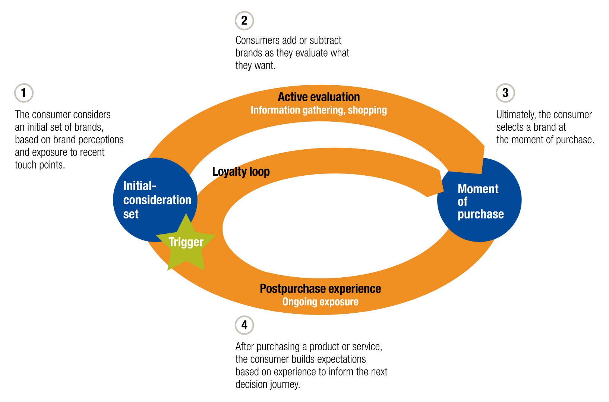

- Stage 1: Initial Consideration

 Content Marketing: Engaging content on social media with tips on how to get a better shave and guides on the benefits of Shaver's Haven products for sensitive skin 

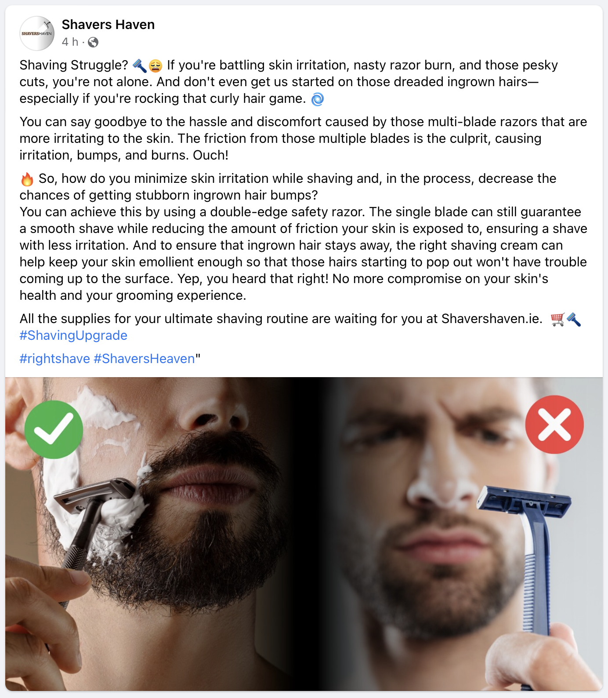

### Social Media Marketing

Showcasing success stories, user testimonials, and educational content about skin-friendly shaving techniques

[Back to top &uarr;](#table-of-contents)

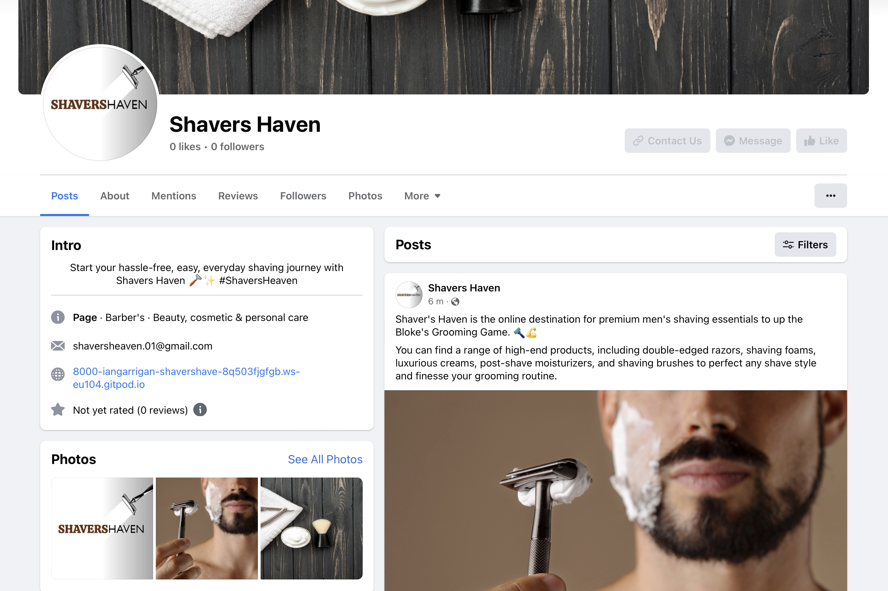

Aiming to become more relevant to consumers and be a strong brand  present in the mind of consumers during their initial consideration stage of the consumers decision journey. 

- Stage 2: Active Evaluation
## SEO
SEO (Search Engine Optimization): Using a mix of head terms and long-tail keywords with low keyword difficulty or competition to ensure that the website ranks high more easily in search results when potential customers look for skin-friendly shaving solutions. 

| Key Words                     | Average Search Volume  | Keyword Difficulty / Competition |
|-------------------------------|------------------------|----------------------------------|
| Shaving                       | 161.5K (Global)        | 24%                              |
| How to shave                  | 35.1K                  | 69%                              |
|  How to shave your face       | 35.1K                  | 52%                              |
| Double edge razor             | 7.9K                   | 18%                              |
| Double edged razor blades     | 6.9K                   | 16%                              |
| Double edged razor            | 4.6K                   | 15%                              |
| Best double edge razor blades | 2.05K                  | 16%                              |
| Double edge safety razor      | 4.6K                   | 20%                              |
| Best razor for sensitive skin | 4.4K                   | High Competition                 |
| Treat razor burn              | 3.6K                   | Low Competition                  |
| Prevent razor burn            | 2.9K                   | Low Competition                  |
| Get rid of shaving pump       | 2.4K                   | Low Competition                  |
| Help with razor burn          | 1.9K                   | Low Competition                  |
| Soothe razor burn             | 1.9K                   | Low Competition                  |

- Copywriting:  In-website communication,  product copywriting description and CTAs to persuade consumers and increase conversion.

Aiming to be at the top or at a relevant position in Google search to reach consumers in the active evaluation of their decision journey.

Stage 3: Moment of Purchase
Website UX/UI: Creating an intuitive and user-friendly website design that makes product exploration and selection effortless.

Aiming to drive high conversion at the moment of purchase of their decision journey.

Stage 4: Post-Purchase Experience
Newsletter Subscriptions: Encouraging customers to subscribe to our newsletter for exclusive grooming tips such as after-purchase customer care, product updates, and special offers.

These strategies ensure that Shaver's Haven effectively addresses customers' needs at every stage of their journey, from consideration to post-purchase satisfaction.

#### facebook business page

## Newsletter 

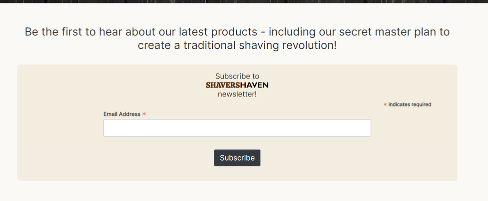

##### The mailchimp embedded newsletter for the business marketing emails.
I've integrated Mailchimp into the website, enabling users to subscribe via an embedded form to learn more about Shavers Haven and encourage repeat business. An automated Welcome email campaign expresses our thanks to subscribers. Additionally, i've created a manual Newsletter campaign, where each subscriber receives valuable content. The goal is to foster a community, which i believe will result in returning customers, ultimately boosting the business.

## Mobile
The website is Mobile First, therefore, the change from mobile to desktop form is seamless and offers users use the same using experience. 

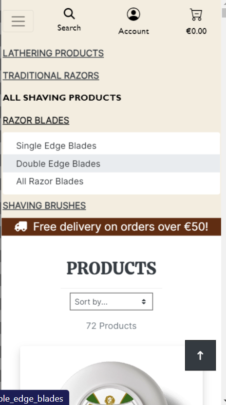

## UI-design 
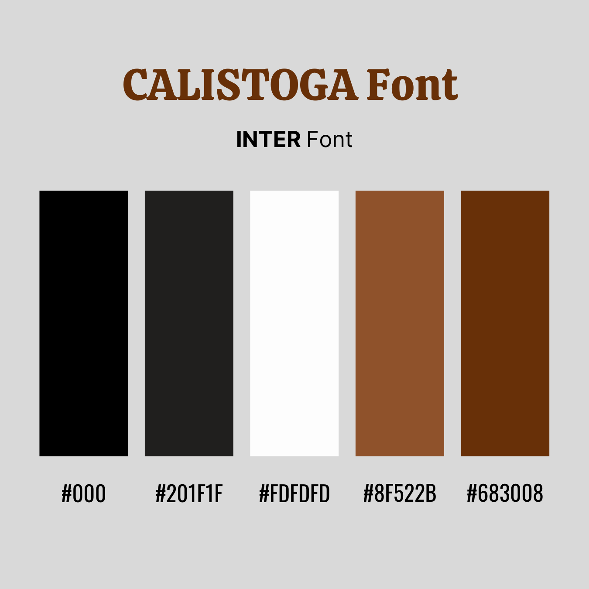

Opted for a minimalistic design, with colour scheme, fonts and squared  lines  that match the target audience ( described under section  “ideal user”) to convey strong brand identity. 

# Wireframes
To kickstart this project, I began by designing a layout using wireframes. For the front page, I opted for a Hero Image to offer users an immediate glimpse into the essence of the business. The product detail pages & all products view, on the other hand, feature individual cards that succinctly present all the essential details – enabling users to quickly assess the product, its price, and a brief description.

Early prototypes:

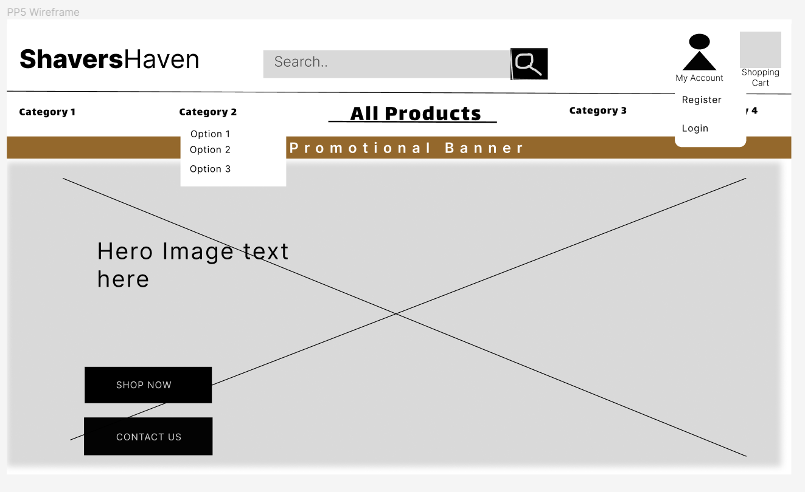
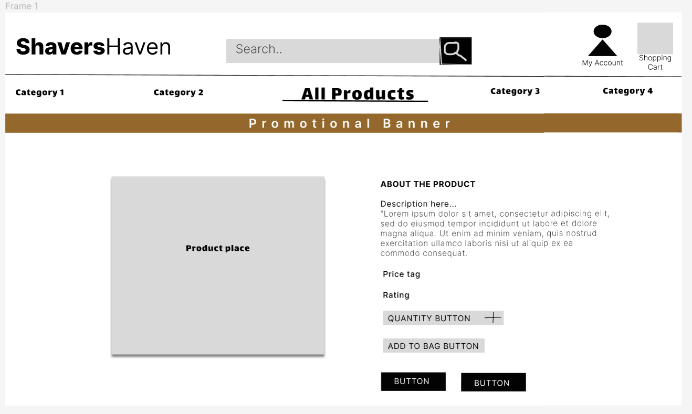
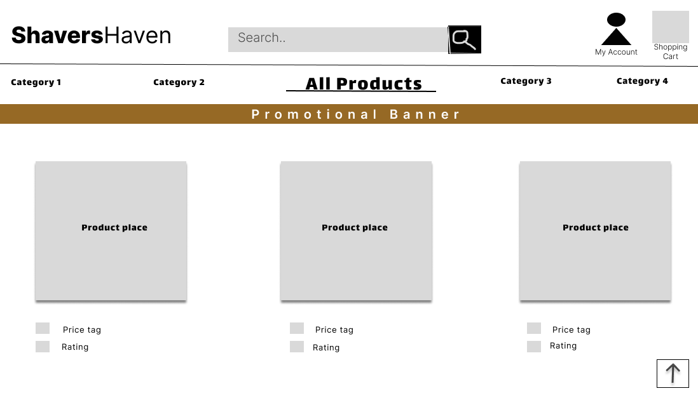
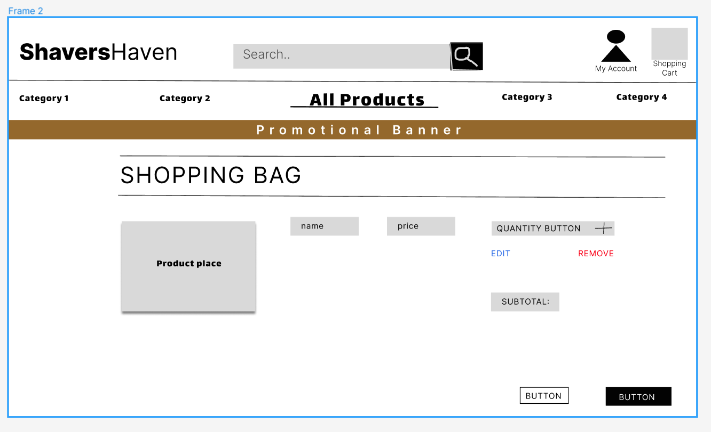

  

# Agile Methodology
I developed this project using agile methodologies, where I split each feature into User Stories, addressing the user's perspective and expectations on the website. I thoughtfully planned these User Stories, resulting in the creation of multiple tasks that I needed to implement specific features. I then grouped these tasks into Epics for efficient project management.

To facilitate and visualize this agile process, I used a Kanban board created within Github Projects, which you can explore [here](https://github.com/users/Ian-Garrigan/projects/6). Each User Story is meticulously detailed with a set of acceptance criteria, clearly defining the required functionality for its completion.

To prioritize my work, I used a labeling system, classifying features as 'Must Have,' 'Should Have,' 'Could Have,' and 'Won't Have.' I gave the highest priority to the 'Must Have' stories, tackling them first to ensure that the project's core requirements were addressed promptly to provide a solid foundation. In some cases, I implemented certain 'Should Have' features ahead of schedule due to their alignment with critical tasks, like some product-related 'Should Have's' being developed alongside 'Must Have' tasks such as error templates. The remaining features were incorporated based on available capacity and timing.

[Back to top &uarr;](#table-of-contents)
