# ShaversHaven

Live [Shavers Haven](https://shavers-haven-b1ce6026470c.herokuapp.com/) deployed website
## Overview

SHAVERS HAVEN is a B2C e-commerce business that offers a range of fast-moving consumer goods within the shaving niche of the cosmetic industry. The SHAVERS HAVEN WEBSITE allows guest or registered users to browse for products, search for products in the search bar, filter or display products according to their preferences, read product descriptions, add products to the cart and complete checkout for product purchase.

## Project Goals

To showcase the skills learned throughout the course and display how such skills were used to build Shavers Haven, a real, fully functional  e-commerce website. 

# Table of Contents

- [Contents](#contents)
    * [UX](#ux)
    * [The ideal User](#the-ideal-user)
    * [Site Goals](#site-goals)
    * [Marketing](#marketing)
        + [SEO](#seo)
        + [Facebook Business Page](#facebook-business-page)
        + [Newsletter](#newsletter)
        + [UI](#ui-design)
    * [Wireframes](#wireframes)
        + [Early Protoypes](#wireframes)
    * [Database Schema](#database-schema)        
    * [Agile Methodology](#agile-methodology)
        + [Canban board and issues](#agile-methodology)
        + [Epics & User Stories](#agile-methodology)
    * [Existing Features](#existing-features)
        + [Homepage](#homepage) 
        + [Landing Page](#landing-page) 
        + [About Us](#about-us)
        + [Newsletter](#newsletter)
        + [Searchbar](#searchbar)
        + [All Products](#all-products)
        + [Product Detail](#product-detail)
        + [Reviews](#reviews)
        + [Admin pages](#admin-pages)
        + [Shopping bag](#shopping-bag)
        + [Order Invoice](#order-invoice)
        + [Wishlist](#wishlist)
        + [Order History](#orddr-history)
        + [Contact Us](#contact-us)
    * [Future Features](#future-features)
        + [Current stock](#current-stock)
        + [Customer Text Reviews](#customer-text-reviews)
    * [Technologies Used](#technologies-used)
        + [Languages Used](#languages-used)
        + [Technologies and Programs Used:](#technologies-and-programs-used-)
        + [Frameworks Libraries and Programs Used](#frameworks-libraries-and-programs-used)
    * [Tests](#tests)
        + [Automated tests](#automated-tests)
        + [Manual tests](#manual-tests)
        + [Lighthouse](#lighthouse)
    * [Bugs](#bugs)
    * [Deployment and making a clone](#deployment-and-making-a-clone)
    * [Credits](#credits)
        + [Online resources](#online-resources)
        + [People](#people)

## **UX**

The UX strategy was developed taking into consideration an analysis of direct and indirect competitors  in the shaving niche and general cosmetics industry such as Shaving.ie  and Lush.com websites as well as target consumer analysis to provide a user experience that aligns with the needs of the ideal audience.  The strategy is based on providing an informative, agile and easy experience so that all users will  be able to understand the purpose of Shavers Haven website, that is to provide everyday consumers with the best shaving equipment supplies. Therefore, upon first visit to the website, users will see the homepage banners that clearly showcases lets consumers know that Shavers Haven sells products related to shaving. Still on the homepage, all users can see a “free delivery” offer enriching the e-shopping  experience. After noticing the Heading and picture  in the homepage, a strategically placed button for “Shop Now” is displayed.  From clicking the button, users will then see the products displayed and be able to browse the full list of products and they will also be able to choose their preferred product display setting, such as alphabetic or pricing order. Users will then be able to click and read information about each product displayed before adding products to the cart. Users then will be able to checkout to complete the purchase.

The fixed navigation bar makes the menu and search bar easily accessible  to users at any stage of their shopping experience. 

### **The Ideal User**

- Grooming Enthusiast: Our ideal user is a grooming enthusiast who values a well-groomed appearance and takes pride in their daily grooming routine.
- Age Range: Typically, our target audience falls within the age range of 30 to 45 years, although anyone seeking premium shaving solutions is welcome.
- Skin Sensitivity: Our user may have sensitive skin and seeks shaving products that prioritize skin health, aiming to minimize irritation and discomfort.
- Preference for Quality: They prioritize quality over quantity, preferring well-crafted tools and products that contribute to a superior shaving experience.
- Online Shoppers: Our ideal user is comfortable shopping online and seeks the convenience of having premium grooming products delivered directly to their doorstep.

### **Site Goals**

- Clearly showcase the purpose of Shavers Haven as a destination for shaving products.
- Offer a "free delivery" incentive on the homepage to enhance the e-shopping experience.
- Provide an easy-to-navigate interface for users to explore and choose from a variety of shaving products.
- Enable users to read detailed product information and complete purchases effortlessly, with accessible navigation and search options.

[Back to top &uarr;](#table-of-contents)

## **Marketing**

The purpose of the application is to serve as a platform for the B2C business model of Shavers Haven which has a direct-to-consumer business strategy. By operating online, it eliminates unnecessary middlemen and passes on the cost savings directly to consumers.

#### Marketing Strategy 
The marketing strategy centres on introducing the solution of safe shaving, designed to minimise skin irritation. This empowers men to confidently showcase their daily appearance, free from red bumps and skin irritation. Shaver's Haven is committed to offering a comfortable shaving experience that not only boosts confidence but also ensures skin well-being.
This will be achieved through Shaver's Havens’ Marketing Plan to assertively communicate with consumers throughout all stages of their buying journey (using McKinsey’s Consumer Decision Journey model). 

- Stage 1: Initial Consideration

 Content Marketing: Engaging content on social media with tips on how to get a better shave and guides on the benefits of Shaver's Haven products for sensitive skin 

### Social Media Marketing

Showcasing success stories, user testimonials, and educational content about skin-friendly shaving techniques

[Back to top &uarr;](#table-of-contents)

Aiming to become more relevant to consumers and be a strong brand  present in the mind of consumers during their initial consideration stage of the consumers decision journey. 

- Stage 2: Active Evaluation
## SEO
SEO (Search Engine Optimization): Using a mix of head terms and long-tail keywords with low keyword difficulty or competition to ensure that the website ranks high more easily in search results when potential customers look for skin-friendly shaving solutions. 

| Key Words                     | Average Search Volume  | Keyword Difficulty / Competition |
|-------------------------------|------------------------|----------------------------------|
| Shaving                       | 161.5K (Global)        | 24%                              |
| How to shave                  | 35.1K                  | 69%                              |
|  How to shave your face       | 35.1K                  | 52%                              |
| Double edge razor             | 7.9K                   | 18%                              |
| Double edged razor blades     | 6.9K                   | 16%                              |
| Double edged razor            | 4.6K                   | 15%                              |
| Best double edge razor blades | 2.05K                  | 16%                              |
| Double edge safety razor      | 4.6K                   | 20%                              |
| Best razor for sensitive skin | 4.4K                   | High Competition                 |
| Treat razor burn              | 3.6K                   | Low Competition                  |
| Prevent razor burn            | 2.9K                   | Low Competition                  |
| Get rid of shaving pump       | 2.4K                   | Low Competition                  |
| Help with razor burn          | 1.9K                   | Low Competition                  |
| Soothe razor burn             | 1.9K                   | Low Competition                  |

- Copywriting:  In-website communication,  product copywriting description and CTAs to persuade consumers and increase conversion.

Aiming to be at the top or at a relevant position in Google search to reach consumers in the active evaluation of their decision journey.

Stage 3: Moment of Purchase
Website UX/UI: Creating an intuitive and user-friendly website design that makes product exploration and selection effortless.

Aiming to drive high conversion at the moment of purchase of their decision journey.

Stage 4: Post-Purchase Experience
Newsletter Subscriptions: Encouraging customers to subscribe to our newsletter for exclusive grooming tips such as after-purchase customer care, product updates, and special offers.

These strategies ensure that Shaver's Haven effectively addresses customers' needs at every stage of their journey, from consideration to post-purchase satisfaction.

#### facebook business page

## Newsletter 

##### The mailchimp embedded newsletter for the business marketing emails.
I've integrated Mailchimp into the website, enabling users to subscribe via an embedded form to learn more about Shavers Haven and encourage repeat business. An automated Welcome email campaign expresses our thanks to subscribers. Additionally, i've created a manual Newsletter campaign, where each subscriber receives valuable content. The goal is to foster a community, which i believe will result in returning customers, ultimately boosting the business.

## Mobile
The website is Mobile First, therefore, the change from mobile to desktop form is seamless and offers users use the same using experience. 

## UI-design 

Opted for a minimalistic design, with colour scheme, fonts and squared  lines  that match the target audience ( described under section  “ideal user”) to convey strong brand identity. 

# Wireframes
To kickstart this project, I originally began by designing a layout using wireframes. For the front page, I opted for a Hero Image to offer users an immediate glimpse into the essence of the business. The product detail pages & all products view, on the other hand, feature individual cards that succinctly present all the essential details – enabling users to quickly assess the product, its price, and a brief description. Soon i added further to these design elements like the ability to create a product wishlist and leave a simple review underneath the detailed individual product pages. I have followed through with all of my original design processes and am happy with how the website turned out in the end. I feel like it offers everything a traditional shaver could want. 

Early prototypes:

  

# Database Schema

The UserProfile and the Product Database serve as the primary components in the schema, connecting all products and profiles. The Products Database enables a connection to the Order Database, including the order number. It also allows for the creation of a Wishlist for users, utilizing a ManyToMany database structure to enable each user to add as many desired products as they wish.

The connection between the Review Database and the Profile Database allows a registered/authenticated user to leave reviews for a product and delete them after if they wish.

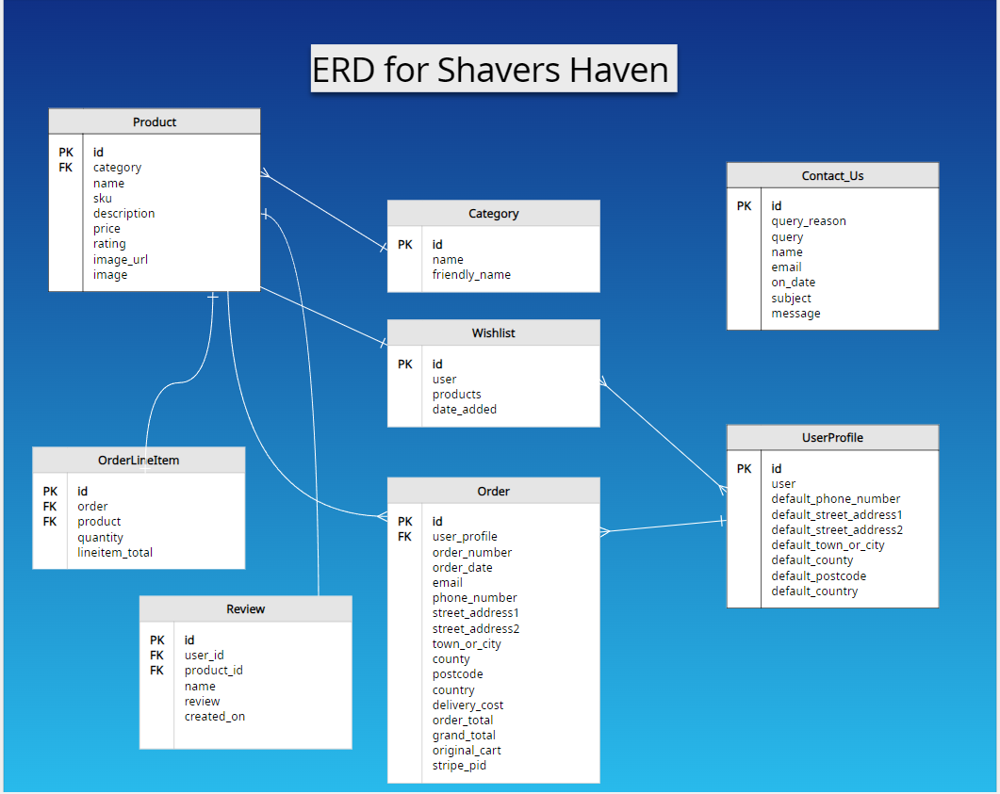

# Agile Methodology
I developed this project using agile methodologies, where I split each feature into User Stories, addressing the user's perspective and expectations on the website. I thoughtfully planned these User Stories, resulting in the creation of multiple tasks that I needed to implement specific features. I then grouped these tasks into Epics for efficient project management.

To facilitate and visualize this agile process, I used a Kanban board created within Github Projects, which you can explore [here](https://github.com/users/Ian-Garrigan/projects/6). Each User Story is meticulously detailed with a set of acceptance criteria, clearly defining the required functionality for its completion.

To prioritize my work, I used a labeling system, classifying features as 'Must Have,' 'Should Have,' 'Could Have,' and 'Won't Have.' I gave the highest priority to the 'Must Have' stories, tackling them first to ensure that the project's core requirements were addressed promptly to provide a solid foundation. In some cases, I implemented certain 'Should Have' features ahead of schedule due to their alignment with critical tasks, like some product-related 'Should Have's' being developed alongside 'Must Have' tasks such as error templates. The remaining features were incorporated based on available capacity and timing.

### Epics & User Stories

I generated a total of 16 Epics, which were subsequently broken down into 27 User Stories. You can explore comprehensive details about each Epic and its associated User Stories on the project's Kanban board linked above.

    #16 EPIC: Document development 

    #15 EPIC: Error template pages 

    #14 EPIC: Contact Us 

    #13 EPIC: Search Engine Optimization (SEO) 

    #12 EPIC: Project Marketing 

    #11 EPIC: Wishlist app 

    #10 EPIC: User Profile 

    #9 EPIC: Stripe payment system EPC

    #8 EPIC: Admin control 

    #7 EPIC: Checkout 

    #6 EPIC: Store Products 

    #5 EPIC: Configure AllAuth 

    #4 EPIC: Shavers Haven Homepage 

    #3 EPIC: Deploy with Heroku 

    #2 EPIC: Set-up media host (AWS) 

    #1 EPIC: Django setup 

# Existing Features

### Homepage: 

The Homepage is a single landing page that has evolved into a straightforward, scrollable design with a dedicated Newsletter section for user engagement. The prominent hero image and accompanying text on the homepage immediately invite users to shop for available items.

### Landing Page: 

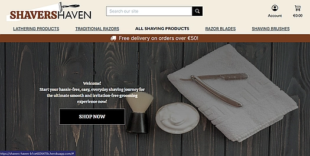

The Landing page features a brief message and it's accompanied by a traditional shaving selection hero image. The background of the page is toned down in brightness to make the text stand out. 

### About Us: 

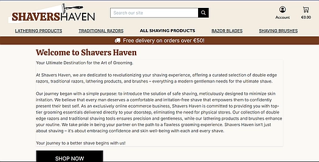

A simple no thrills page that gives the user a story about the business which can be pleasing to know for some potential buyers. 

### Newsletter:

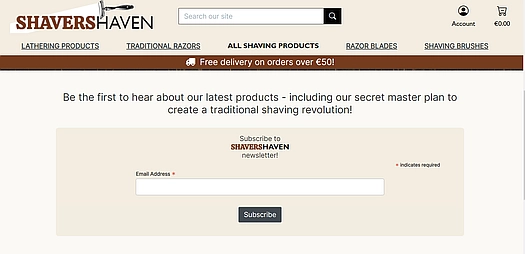

The Newsletter section boasts an elegantly designed embedded form created with Mailchimp.com. This form allows users to easily subscribe to our site's Newsletter, ensuring they stay informed about the latest updates and offerings by e-mail. 

### Searchbar: 

At any point, users have the option to use the Search bar in the main header. Here, users can input their search query, and upon pressing enter or click on the magnifying glass icon, they will be redirected to the Products Page where their search results are displayed. 

### All Products:

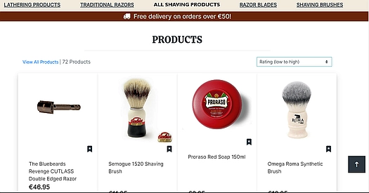

The Products Page presents a comprehensive list of all available products. Users can pick through the range of products by selecting a specific category or brand from the dropdown menu in the navigation bar.

Each individual product is presented in a card format, containing essential details such as rating, price, brand, and category. All of these attributes can be filtered by use of a dropedown list. 

### Product Detail: 

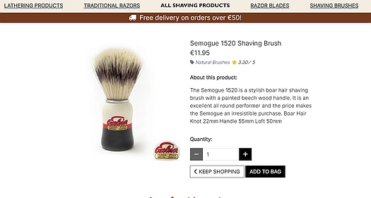

The product detail page shows a larger product image, a description for the product, as well as allowing the user to add this product to their bag for future checkout.

### Reviews:

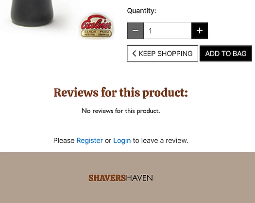

Only registered users can leave a review on products. The reviews are embedded quickly onto the products details page second section. Users can delete the review the left just as easily with the delete button. 

### Admin pages:

Access to adding, editing, or deleting products is exclusively granted to staff, specifically super users. When administrators are logged in, they will notice the 'Product Management' link displayed within the 'Account' dropdown menu. Clicking on this link will redirect staff members to the 'Add Product' page, where they can enter a new product.

### Shopping bag:

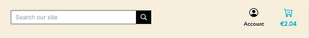

Users have the flexibility to add products to their shopping bag from either the 'All Products' page or the 'Product Detail' page. When the 'Add to bag' button is clicked, a toast message promptly appears, displaying item cost and continue to checkout button. The Navbar shopping bag amount is updated in real-time. Users can initiate the checkout process by clicking either the shopping bag icon or the 'Go to Secure Checkout' link within the mentioned toast message.

### Checkout:

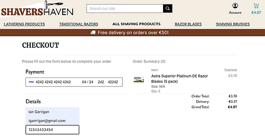

The checkout page is designed to provide users withdetails of their potential purchase. It shows the selected products, their prices, quantity, captures user billing information, and integrates a secure Stripe element for card payments.

### Order invoice:

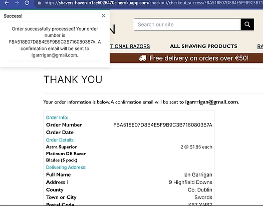

After a secure checkout, users are redirected to the Order Complete page, where an overview of the order is presented, including all the essential details. For registered users, the order is seamlessly updated in their Profile's Order History.

To enhance the user experience, i tried to send out a custom email notification system so both registered and guest users receive a detailed email containing their order specifics. However i could not get it to function approriately, one for the future.

### Wishlist: 

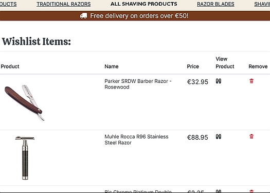

The Wishlist page displays to the user a list of products they've marked as favorites by simply clicking the bookmark style icon on each product. This page offers a concise summary of each product along with a direct clickable viewfinder icon to its detailed products page, making it easy for users to add it to their cart.
Adding or removing products from the wishlist is a breeze - just click the bookmark style icon on a product from  the 'All Products' page. Toast notifications pop up to confirm any addition,currently already in the list or ,removal from the wishlist. Users can also  efficiently manage their entire wishlist, with options to clear the entire list or remove individual items accordingly.

### Order History:

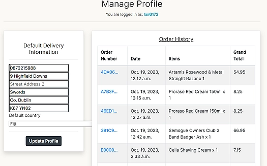

The Order History section offers users a comprehensive record of all their past orders. Each order is presented with its contents and a direct link to the Order Complete page, where users can access all the order details, including billing and shipping information. It serves as a convenient summary of all previous purchases, allowing users to review their order history effortlessly.

### Contact Us: 

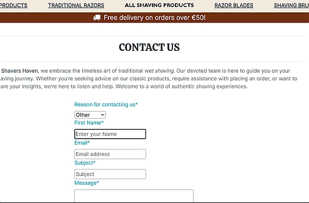

The Contact Us page is accessible to all users via the 'Contact Us' link in the Footer. When clicked, users are directed to the Contact Us page, where they can select the nature of their inquiry and enter their message. The page features a user-friendly form for contacting the business, with all submitted information conveniently stored in the Admin panel for easy access by superusers.

# Testing

