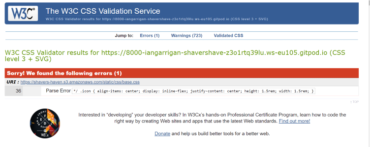
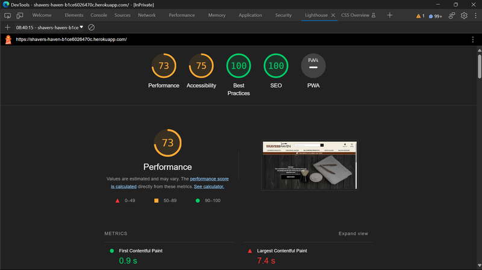
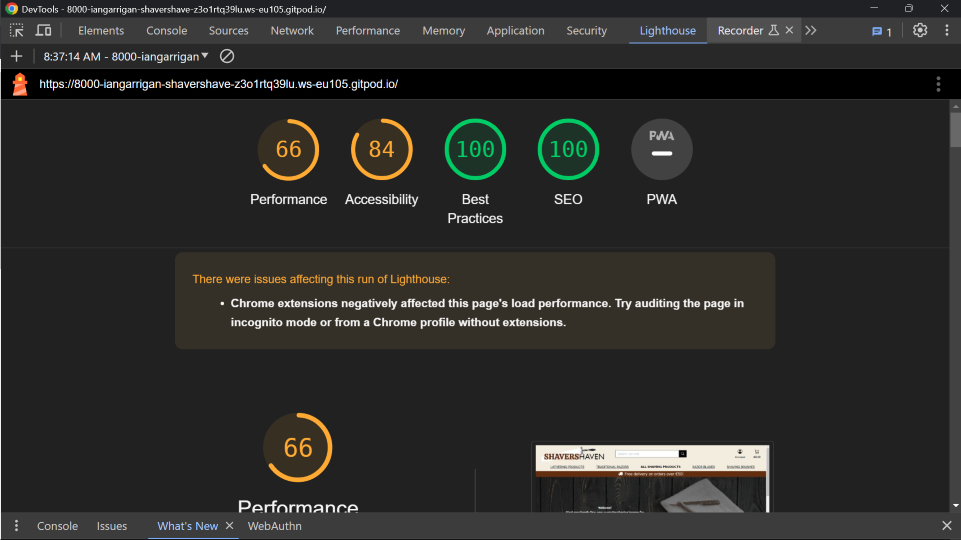
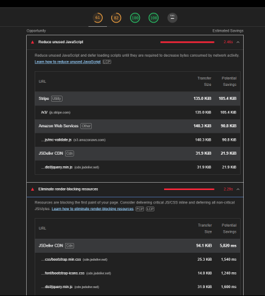

# Validator Testing

### W3C

- Passed all html validation with only 3 warnings. 

### Jigsaw 

- Only one existing error concerning a ParseError which i could not find a way to treat.

### Python 

- No errors were returned when passing through the college [CI Python Linter](https://pep8ci.herokuapp.com/)

# Lighthouse 

Testing the performance on desktop seemed to be below average due to a big data payload coming from AWS, CDN hosts and a poor local network. 

#### Lighthouse Mobile 

Same performance reached on mobile device. I tested it on motorola g power, one plus nord and google pixel devices. 

I can only presume most of the poor performance is from outside factors. I took the time to convert all my products image types in the  database to WEBP using [irfanView 68](https://www.irfanview.com/). Unused Javascript accounted for a 2.36 secs time delay too. 

# Device responsiveness 

Using physical devices and online resources eg (https://responsivedesignchecker.com/) to test smaller handheld devices i tested for any poor response from various scrolling and tapping tests on each page of the website. Here is a table of the results i gained: 

| **Browser Tested** | **Actual Result** | **Pass/Fail** |
| ------------------ | ----------------- | ------------- |
| Firefox             | As Expected       | Pass          |
| Chrome            | As Expected       | Pass          |
| Edge               | As Expected       | Pass          |
| Safari      | As Expected       | Pass          |
| Opera      | As Expected       | Pass          |

| **Device Tested**    | **Actual Result** | **Pass/Fail** |
| -------------------- | ----------------- | ------------- |
| Mac Air M2           | As Expected       | Pass          |
| Samsung Note 10+     | As Expected       | Pass          |
| Samsung Note 20      | As Expected       | Pass          |
| Samsung S21+         | As Expected       | Pass          |
| Samsung Tab S7+      | As Expected       | Pass          |
| iPhone 13 Pro Max    | As Expected       | Pass          |
| iPhone 12           | As Expected       | Pass          |
| iPad Pro 12     | As Expected       | Pass          |
| One Plus Nord        | As Expected       | Pass          |
| Xiaomi Redmi Note 11 | As Expected       | Pass          |
| Google Pixel 6 | As Expected       | Pass          |

# Defensive programming

I've implemented the necessary features to ensure the utmost data security and controlled access. I've incorporated user authentication and authorization throughout the project. In addition, I've used 'Login_required' decorators to protect additional areas. Django auth provides an extra layer of security for enhanced data protection.

# Manual Testing

### NAVBAR : 

| **Test case**    | **Testing undertook** | **Result** | **Fix** |
| -------------------- | ----------------- | ------------- |--------    
|    1       | clicking on the navbar shavers haven logo        | Expected. Redirects me to the home index page  |      none   |
|   2 | clicking on the all products link in the navbar | Expected. Toggles open a dropdown menu with three different sorting categories to choose from | none  |
|  3 | clicking on razors from the navbar | Expected. Toggles a dropdown of 3 different categories  | none   |
|  4   | clicking on Account from nav  | Expected. toggles a dropdown menu with login and register if not already authenticated. |  none  |
| 5  | clicking on shopping bag icon  | expected. Brings me to shopping-bag.html page  | none |
| 6 | clicking on search bar and input a query | not expected. after searching for the term 'soft cream' a few razor blades showed up  | alter the descriptions of each product that has misleading search affect. |
| 7  | clicking on Account on navbar again | Expected.  reveals wishlist, my profile, product management, logout in the dropdown because i was signed in | none |  
| 8 | clicking on  search with a blank input |  not expected. i am brought to the products page | none necessary for this instance  | 
| 9     | clicking on search bar and input 'sharp'  | expected. multiple types of blades show up | none  |     
| 10 | searching for random letters and numbers in the search box | the products page is loaded with 0 product results | none | 

### BAG:

| **Test case**    | **Testing undertook** | **Result** | **Fix** |
| -------------------- | ----------------- | ------------- |--------    
|    1  | Clicking on the Shopping cart button | Expected.Brings the user to their shopping cart |   none   |
|   2 | Clicking on the update quantity button for desired item| Expected. Updates the quantity successfully as long as it is withing the threshold | none  |
|  3 | Updating the quantity with an empty box | Expected. Warning toast to input a quantity into the quantity box | none |
|  4   | Updating the quantity to random quantity 37498  | Expected. Warning toast- Maximum quantity for product is 10 |  none  |
| 5  | Incrementing quantity of item using the buttons provided  | expected. Button disables at quantity 1 as that's the lowest input. Button disables at quantity 10 as that's the highest input | none |
| 6 | Clicking on the remove button under the quantity input box | Removes the item from the shopping cart successfully and is greeted with the (Your shopping cart is empty) message if there is nothing else in the basket | none |
| 7  | Clicking on the Keep Shopping button under the grand total | Expected. Brings the user back to the products page to shop around | none |  
| 8 | Clicking on the Secure checkout button under the grand total |  Brings the user to the checkout page where they can complete their order | none | 

### Checkout 

| **Test case**    | **Testing undertook** | **Result** | **Fix** |
| -------------------- | ----------------- | ------------- |--------    
|    1  | Clicking on the adjust bag button | Expected.Brings the user to their shopping cart |   none   |
|   2 | Clicking on the compplete order button when delivery info is not filled out | Expected. user is told they must sign in to complete order | none  |
|  3 | filling in the wrong card payment for stripe | Expected. user is informed they must enter a valid number | none |
|  4   | Clicking on complete order when all fields are filled out correctly | user is notified the order is successful and a toast box and reciept are rendered | none |

### User Profile 

| **Test case**    | **Testing undertook** | **Result** | **Fix** |
| -------------------- | ----------------- | ------------- |--------    
|    1  | Clicking on the my Profile dropdown | Expected.Brings the user to their profile page for order history and update address |   none   |
|   2 | Clicking on the update profile button | Expected. updates the user delivery infomation quickly | none  |
|  3 | clicking on delete button under the users wishlist| Expected. clears the entire wishlist | none |
|  4   | Completing an order and reviewing it|the order history will show your number and datr. | none |

### PRODUCTS

| **Test case**    | **Testing undertook** | **Result** | **Fix** |
| -------------------- | ----------------- | ------------- |--------    
|    1  | Clicking on the Products page as user | Expected. Displays the stock of computers/items the site has to offer |   none   |
|   2 | Clicking on the Products wishlist button | Expected. Adds the item to users wishlist and redirects him to that products details page | none  |
 |  3 | Clicking on the Product Item | Expected.Brings the user to that product details page where he can add to bag / adjust quantity and read more about item|none|
 |  4   | Clicking on the Add to Bag button on Product details page | Expected. Adds the item to the users bag and is greeted with a toast pop up that the item has been added and can keep shopping |  none  |
| 5  | Clicking on the Keep Shopping button on the Product details page  | expected. Brings the user back to the products page to keep shopping | none |
| 6  | Clicking on the Quantity input buttons on Product details page| Expected. Brings the user to the desired page containing different products| none |  
| 8 | Clicking add to bag while there is no quantity put in for the item | Gives the user a warning. Must enter quantity | none | 
 

### CONTACT US:

| **Test case**    | **Testing undertook** | **Result** | **Fix** |
| -------------------- | ----------------- | ------------- |--------    
|    1  | Clicking on contact us link in footer | Expected. Displays the contact us form  |   none   |
|   2 | Clicking on the cancel button for contact form | Expected. The form is not submitted | none  |
 |  3 | Clicking on the reason for contacting us dropdown  | Expected. A dropdown of reasons to select from appears|none|
 |  4   | Clicking on the submit button when form is filled correctly | Expected. Messages success is display and form is submitted to database. |  none  |

 # Automated testing 

 
