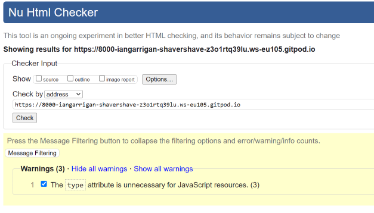

# Validator Testing

### W3C

- Passed all html validation with only 3 warnings. 

### Jigsaw 

- Only one existing error concerning a ParseError which i could not find a way to treat.

### Python 

- No errors were returned when passing through the college [CI Python Linter](https://pep8ci.herokuapp.com/)

# Lighthouse 

Testing the performance on desktop seemed to be below average due to a big data payload coming from AWS, CDN hosts and a poor local network. 

#### Lighthouse Mobile 

Same performance reached on mobile device. I tested it on motorola g power, one plus nord and google pixel devices. 

I can only presume most of the poor performance is from outside factors. I took the time to convert all my products image types in the  database to WEBP using [irfanView 68](https://www.irfanview.com/). Unused Javascript accounted for a 2.36 secs time delay too. 

# Device responsiveness 

Using physical devices and online resources eg (https://responsivedesignchecker.com/) to test smaller handheld devices i tested for any poor response from various scrolling and tapping tests on each page of the website. Here is a table of the results i gained: 

| **Browser Tested** | **Actual Result** | **Pass/Fail** |
| ------------------ | ----------------- | ------------- |
| Firefox             | As Expected       | Pass          |
| Chrome            | As Expected       | Pass          |
| Edge               | As Expected       | Pass          |
| Safari      | As Expected       | Pass          |
| Opera      | As Expected       | Pass          |

| **Device Tested**    | **Actual Result** | **Pass/Fail** |
| -------------------- | ----------------- | ------------- |
| Mac Air M2           | As Expected       | Pass          |
| Samsung Note 10+     | As Expected       | Pass          |
| Samsung Note 20      | As Expected       | Pass          |
| Samsung S21+         | As Expected       | Pass          |
| Samsung Tab S7+      | As Expected       | Pass          |
| iPhone 13 Pro Max    | As Expected       | Pass          |
| iPhone 12           | As Expected       | Pass          |
| iPad Pro 12     | As Expected       | Pass          |
| One Plus Nord        | As Expected       | Pass          |
| Xiaomi Redmi Note 11 | As Expected       | Pass          |
| Google Pixel 6 | As Expected       | Pass          |

# Defensive programming

I've implemented the necessary features to ensure the utmost data security and controlled access. I've incorporated user authentication and authorization throughout the project. In addition, I've used 'Login_required' decorators to protect additional areas. Django auth provides an extra layer of security for enhanced data protection.

# Manual Testing

NAVBAR : 

| **Test case**    | **Testing undertaken** | **Result** | **Fix** |
| -------------------- | ----------------- | ------------- |--------    
|    1       | clicking on the navbar shavers haven logo        | Expected. Redirects me to the home index page  |      none   |
|   2 | clicking on the all products link in the navbar | Expected. Toggles open a dropdown menu with three different sorting categories to choose from | none  |
|  3 | clicking on razors from the navbar | Expected. Toggles a dropdown of 3 different categories  | none   |
|  4   | clicking on         | result:           |    |
| 5  | clicking on        | result:           |    |
| 6 | clicking on        | result:           |    |
| 7       | clicking on        | result:           |       |  
| 8 | clicking on        | result:           |            | 
| 9     | clicking on        | result:           |       |     
| 10 | clicking on        | result:           |       | 
|  11 | clicking on        | result:           |      |      |

BAG:

FOOTER:

MAIN NAV: 

CHECKOUT:

USER PROFILE:

PRODUCTS:

CONTACT US:

REVIEW:

WISHLIST:

SEARCH: 

